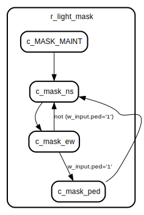
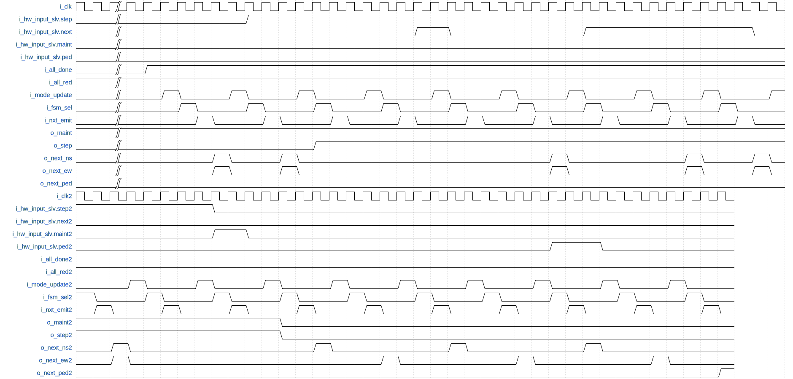
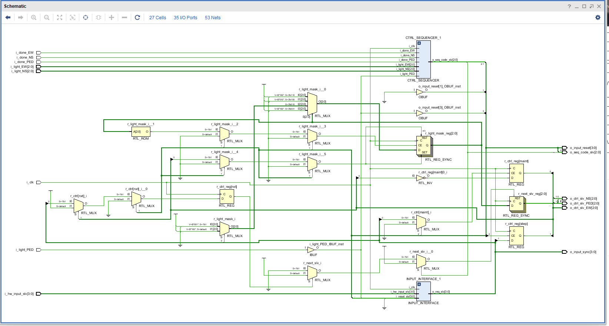
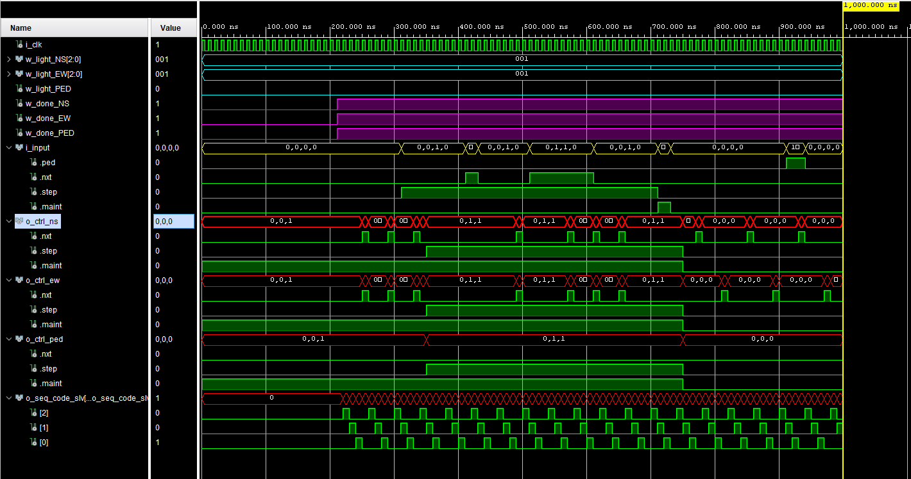

&nbsp;&nbsp;

# Entity: FSM_CONTROL
## Description
This module is responsible for synchronizing the effect of hardware input stimulus changes on the behaviour of each light fsm.
## Interface

## State machine

## Waveform:
 
## Types:
  -  [trec_input](INPUT_INTERFACE.md)
  -  [trec_seq_code](CTRL_SEQUENCER.md)
  -  trec_fsm_ctrl:
	  
## Generics and ports
### Table 1.1 Generics
### Table 1.2 Ports

| Port name      | Direction | Type                          | Description                                |
| -------------- | --------- | ----------------------------- | ------------------------------------------ |
| i_clk          | in        | std_logic                     |  clock                                     |
| i_hw_input_slv | in        | tslv_input                    |  serialized trec_input from the basys3 IOs |
| i_done_NS      | in        | std_logic                     |  NS FSM is ready for transition            |
| i_done_EW      | in        | std_logic                     |  EW FSM is ready for transition            |
| i_done_PED     | in        | std_logic                     |  PED FSM is ready for transition           |
| i_light_NS     | in        | std_logic_vector(2 downto 0 ) |  NS FSM Light output                       |
| i_light_EW     | in        | std_logic_vector(2 downto 0 ) |  EW FSM Light output                       |
| i_light_PED    | in        | std_logic                     |  PED FSM Light output                      |
| o_ctrl_slv_NS  | out       | tslv_fsm_ctrl                 |  NS light fsm control vectors              |
| o_ctrl_slv_EW  | out       | tslv_fsm_ctrl                 |  EW light fsm control vectors              |
| o_ctrl_slv_PED | out       | tslv_fsm_ctrl                 |  PED light fsm control vectors             |
| o_seq_code_slv | out       | tslv_seq_code                 |  sequence code vector towards ILA          |
| o_input_reset  | out       | tslv_input                    |  for ila                                   |
| o_input_sync   | out       | tslv_input                    |                                            |

## Signals, constants and types
### Signals

| Name              | Type                         | Description                                               |
| ----------------- | ---------------------------- | --------------------------------------------------------- |
| w_input           | trec_input                   |  the synchronized input signals from the interface module |
| w_reset           | trec_input                   |  the reset signals towards the input module               |
| w_input_slv       | tslv_input                   |  serial format of former                                  |
|  w_reset_slv      | tslv_input                   |  serial format of former                                  |
| w_seq_code        | trec_seq_code                |  the sequence code interface from the sequencer           |
| w_seq_code_slv    | tslv_seq_code                |  serial format of former                                  |
| w_ctrl_NS         | trec_fsm_ctrl                |  control interface for controling the light FSMs          |
| w_ctrl_EW         | trec_fsm_ctrl                |  control interface for controling the light FSMs          |
| w_ctrl_PED        | trec_fsm_ctrl                |  control interface for controling the light FSMs          |
| r_ctrl            | trec_fsm_ctrl                |  controller control values register                       |
| r_light_mask      | std_logic_vector(2 downto 0) |  light mask selector's fsm register                       |
| r_next_slv        | std_logic_vector(2 downto 0) |  next-signal's output value register                      |
| w_next_light_mask | std_logic_vector(2 downto 0) |                                                           |

### Constants
| Name         | Type                         | Value  | Description                                                                          |
| ------------ | ---------------------------- | ------ | ------------------------------------------------------------------------------------ |
| c_MASK_NS    | std_logic_vector(2 downto 0) |  "100" |  mask that activates the next signal for the NS fsm                                  |
| c_MASK_EW    | std_logic_vector(2 downto 0) |  "010" |  mask that activates the next signal for the EW fsm                                  |
| c_MASK_PED   | std_logic_vector(2 downto 0) |  "001" |  mask that activates the next signal for the PED fsm                                 |
| c_MASK_MAINT | std_logic_vector(2 downto 0) |  "110" |  mask that activates the next signal for the fsms involved with the maintenance mode |

## Processes
### p_MODE_UPDATE: ***( i_clk )***
 Clocked process active when the sequencer's seq-code is "1--". During this stage, 
 the input interface's step-mode and maintenance-mode signal changes are acknowledged and 
 forwarded to the light fsms, and the input latches are resetted.

### p_FSM_SELECT: ***( i_clk )***
 Clocked process active when the sequencer's seq-code is "-1-". During this stage,
 any next-event from the input interface are acknowledged if the step mode is active and 
 the latch of the next-event is resetted. Also, the internal r_light_mask register's value 
 is updated to reflect changes in the active priority of the intersection based on any of the following:
   - A pedestrian request during a proper priority state of the intersection
   - A maintenance mode change during a proper priority state of the intersection
   - A normal progression through the priority cycles 

### p_NEXT_EMISSION**: ***( i_clk )***
 Clocked process active when the sequencer's seq-code is "--1". During this stage,
 the next vector signal is emitted to the state machines if both of the conditions
 below are met:
 - The control register's next value is high.
 - The light mask register's value is high for a given state machine.

## Instantiations
- **INPUT_INTERFACE_1**: work.INPUT_INTERFACE

- **CTRL_SEQUENCER_1**: work.CTRL_SEQUENCER
 Produces the control sequence's stage synchronization signals.

## Elaboration:

## Simulation:

# [RETOUR](../README.md)