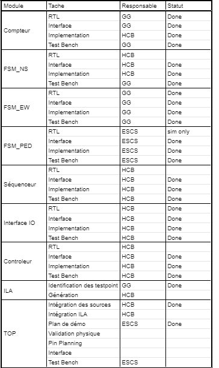

# Projet : ELE739 - Phase1
Développeurs :			
	- Ernesto Sabato Castaldo Santillàn,
	- Gabriel Gandubert
	- Hugo Cusson-Bouthillier
Date de remise :		5 février 2021
Institution :			École de technologie supérieure, Mtl
platforme de développement : 	Vivado 2018.3
Carte FPGA :			Basys3 - Xilinx

# INTRODUCTION :
Ce projet permet de contrôler le fonctionnement de feux de circulations incluant un passage piéton.
L'intersection est composé de deux rues bidirectionnelles nommées rue principale et rue secondaire 
ou rue nord-sud et est-ouest. Le passage piéton peut être activé par un bouton de demande 
d'activation de passage piéton, qui arrivera à la fin du cycle de la rue principale. Lors du passage 
piéton, les deux rues sont au rouge et reprennent leur fonctionnement normal après la séquence de 
traverse piéton. L'indicateur de priorité de passage aux piéton suit la séquence "GO", pulsation du
signal "GO" pour indiquer l'arrêt iminent et arrêt. À la fin du passage piéton, les lumières
reprennent leurs cycle normal. Un bouton d'initialisation est accessible par la municipalité pour
réinitialiser les lumières de circulation. Lorsque les lumières sont en mode maintenance, les feux
rouges allument et ferment à une fréquence fixe. Une fois la maintenance terminée, la séquence 
reprends un cycle normal.

# PLANIFICATION DES ENTRÉES ET SORTIES DU FPGA :
Les entrées et sorties du système peuvent être simulé par des boutons et des lumières présents sur
la carte Basys3 de Xilinx. Les entrées et sorties sont comme suit:
## Liste des entrées :

| Description                    | Pin Name  | Pin number | Effet                                |
| ------------------------------ | --------- | ---------- | ------------------------------------ |
| BOUTON DEMANDE PIÉTON          | BTNL      |  [W19]     |  Demande de passage piéton           |
| BOUTON DE MAINTENANCE          | BTNC      |  [U18]     |  Mode maintenance ON/OFF à l'appuie  |
| INTERRUPTEUR DE MODE PAS-À-PAS | SW[0]     |  [V17]     |  Activation mode pas-à-pas           |
| BOUTON PROCHAIN ÉTAT PAS-À-PAS | BTNR      |  [T17]     |  Passage d'un état à l'autre         |

## Liste des sorties :

| Description                    | Pin Name  | Pin number      | Effet                           |
| ------------------------------ | --------- | --------------- | ------------------------------- |
| LUMIÈRE RUE PRINCIPALE		 | LED[0-2]  | [U16, E19, U19] | Feux rue principale (RJV)       |
| LUMIÈRE RUE SECONDAIRE		 | LED[3-5]  | [V19, W18, U15] | Feux rue secondaire (RJV)       |
| LUMIÈRE PIÉTON			     | LED[6]    | [U14]		   | Lumière priorité piéton         |
| SIGNAL D'ACTIVATION		     | LED[7]    | [V14]		   | Activation demande passage      |

## Répartition des taches:

## PLAN DES FICHIERS CONTENU DANS CE PROJET :
 - src: Contient le code source du projet
 - sim: Contient les testbench du projet
 - doc: Contient la doc du projet
   - [CTRL_SEQUENCER](doc/CTRL_SEQUENCER.md)
   - [FSM_CONTROL](doc/FSM_CONTROL.md)
   - [TOP](doc/TOP.md)
   - [INPUT_INTERFACE](doc/INPUT_INTERFACE.md)
   - autres documents word
