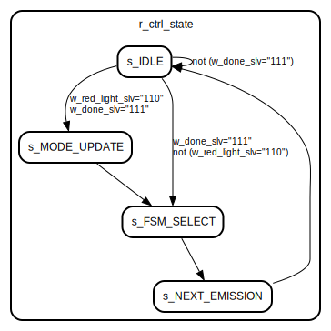
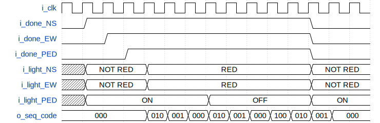
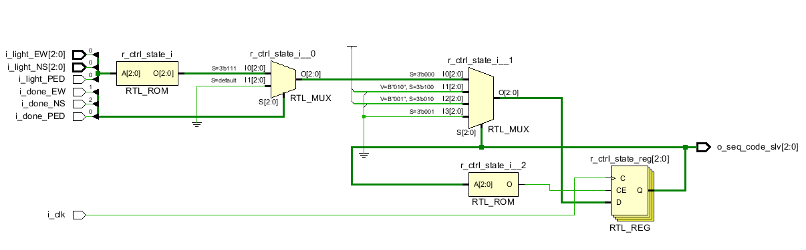
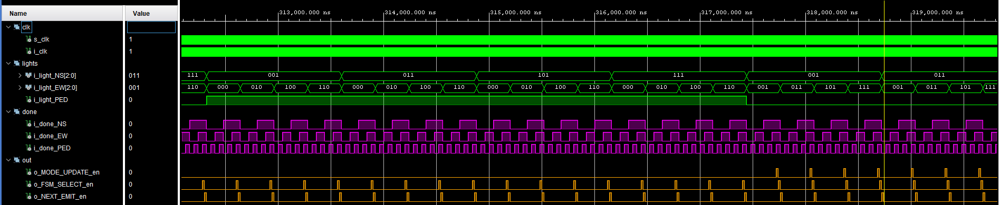

&nbsp;&nbsp;

# Entity: CTRL_SEQUENCER
## Description
 This module is responsible for synchronizing the 4 stages of the controller sequence which are:
  * **idle**  Initial state of the sequence, in which we wait for:
	 - all fsm to be done but not red which causes a transition to the fsm_select stage
	 - all fsm to be done and red which causes a transition to the mode-update stage.
 
  * **mode-update**
 	Only occures if all lights are done and red. During this stage, any changes in step-mode or maintenance-mode made by the user are acknowledged and forwarded to each light fsm. At the next clock rise, a transition is done to the fsm_select stage.

  *  **fsm_select:**  Stage in which the selection of which fsm is to be sensible to a next signal is done. At next clock rise, go to next-emit stage.
  * **next_emit:** Stage during which a next signal is sent to the the selected fsms.At next clock rise, go to idle.
## Interface

## State machines
The fsm implementation driving the sequencer.

## Waveform:
 
## Types:
  - trec_seq_code:
     

 
## Generics and ports
### Table 1.1 Generics
### Table 1.2 Ports

| Port name      | Direction | Type          | Description                                                                 |
| -------------- | --------- | ------------- | --------------------------------------------------------------------------- |
| i_clk          | in        | std_logic     |  clock                                                                      |
| i_done_NS      | in        | std_logic     |  done signal from light fsms indicating that they are ready to receive next |
| i_done_EW      | in        | std_logic     |  done signal from light fsms indicating that they are ready to receive next |
| i_done_PED     | in        | std_logic     |  done signal from light fsms indicating that they are ready to receive next |
| i_light_NS     | in        | tslv_seq_code |  the fsm lights state                                                       |
| i_light_EW     | in        | tslv_seq_code |  the fsm lights state                                                       |
| i_light_PED    | in        | std_logic     |  the FSM light of the pedestrian                                            |
| o_seq_code_slv | out       | tslv_seq_code |  the sequence control code                                                  |

## Signals, constants and types
### Signals

| Name            | Type                         | Description            |
| --------------- | ---------------------------- | ---------------------- |
| w_red_light_slv | std_logic_vector(2 downto 0) |  signal aggregate      |
| w_done_slv      | std_logic_vector(2 downto 0) |  signal aggregate      |
| r_ctrl_state    | std_logic_vector(2 downto 0) |  seqence code register |
| w_seq_code      | trec_seq_code                |                        |

### Constants

| Name            | Type                         | Value  | Description                          |
| --------------- | ---------------------------- | ------ | ------------------------------------ |
| s_IDLE          | tslv_seq_code                |  "000" |  idle seq code                       |
| s_MODE_UPDATE   | tslv_seq_code                |  "100" |  mode update seq code                |
| s_FSM_SELECT    | tslv_seq_code                |  "010" |  fsm_select seq code                 |
| s_NEXT_EMISSION | tslv_seq_code                |  "001" |  next emit seq code                  |
| c_LIGHT_STATE_W | natural                      |  7     |  deprecated                          |
| c_ALL_RED       | std_logic_vector(2 downto 0) |  "110" |  aggregate value for idle transition |
| c_ALL_DONE      | std_logic_vector(2 downto 0) |  "111" |  aggregate value for idle transition |

## Processes
### p_ctrl_seq: ***( i_clk )***
 The fsm implementation driving the sequencer.

## Elaboration:
 
## Simulation:

# [RETOUR](../README.md)