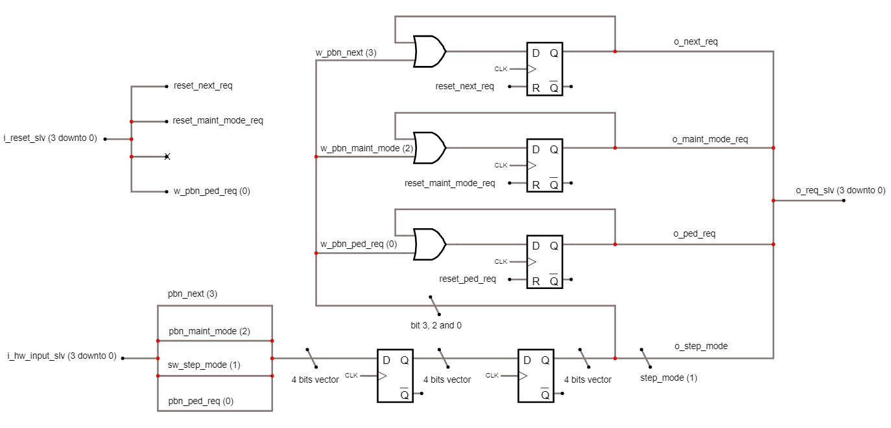
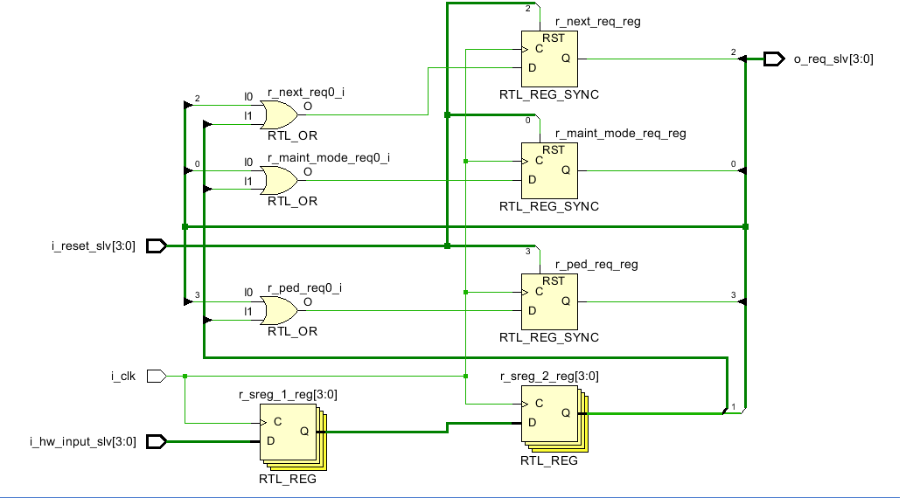
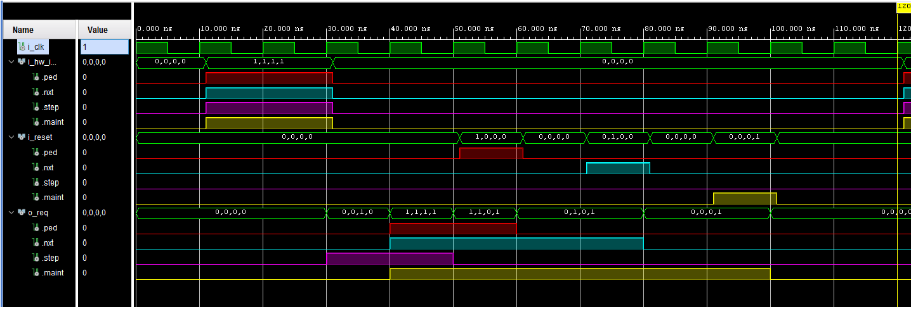

&nbsp;&nbsp;

# Entity: INPUT_INTERFACE
## Description
 This module synchronizes the async inputs of the basys3 and manages reset behaviour on them.
## Interface

## Waveform
 
## Types
  -  trec_input: 
      
## RTL

## Generics and ports
### Table 1.1 Generics
### Table 1.2 Ports

| Port name      | Direction | Type       | Description                                      |
| -------------- | --------- | ---------- | ------------------------------------------------ |
| i_clk          | in        | std_logic  |  clock                                           |
| i_reset_slv    | in        | tslv_input |  entree des reset pour les latch                 |
| i_hw_input_slv | in        | tslv_input |  entree des io asynchrones                       |
| o_req_slv      | out       | tslv_input |  sortie des signaux de requete usager synchrones |

## Signals, constants and types
### Signals
| Name             | Type                         | Description                                              |
| ---------------- | ---------------------------- | -------------------------------------------------------- |
| r_sreg_1         | std_logic_vector(3 downto 0) |  sync register                                           |
| r_sreg_2         | std_logic_vector(3 downto 0) |  sync register for the 4 async inputs                    |
| w_pbn_next       | std_logic                    |   alias for locally synchronized async input counterpart |
| w_pbn_ped_req    | std_logic                    |   alias for locally synchronized async input counterpart |
| w_pbn_maint_mode | std_logic                    |   alias for locally synchronized async input counterpart |
| w_reset          | trec_input                   |  record interface instances                              |
|  w_req           | trec_input                   |  record interface instances                              |
|  w_sync          | trec_input                   |  record interface instances                              |
|  w_hw_in         | trec_input                   |  record interface instances                              |
| r_next_req       | std_logic                    |  button latch register                                   |
| r_ped_req        | std_logic                    |  button latch register                                   |
| r_maint_mode_req | std_logic                    |                                                          |

## Processus
- **p_SYNC**: ***( i_clk )***
 synchronization process
 2 registers 4-wide in series to synchronize ios

- **p_EDGE_PBNS**: ***( i_clk )***
 processus des latch pour les signaux des boutons
 chaque sortie de bouton doit etre mis a 1 lors d'un push usager
 elle le demeure tant que son signal de reset n'est pas mis a 1

## Elaboration

## Simulation

# [RETOUR](../README.md)