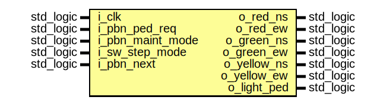
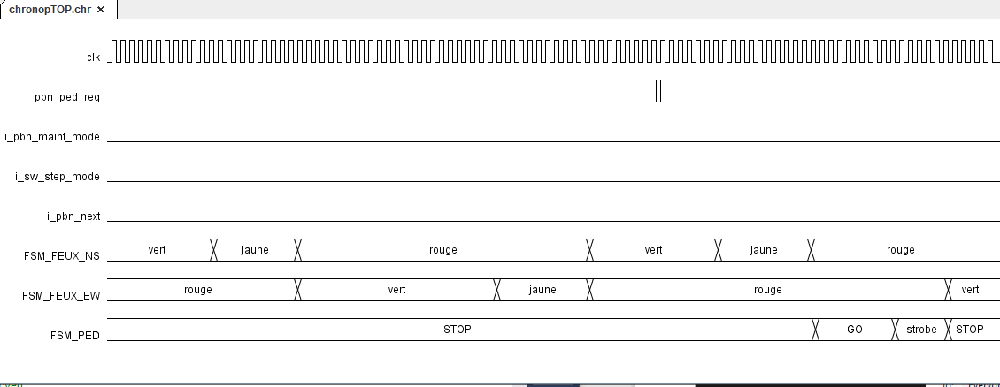
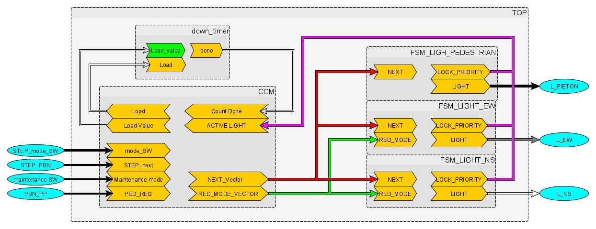
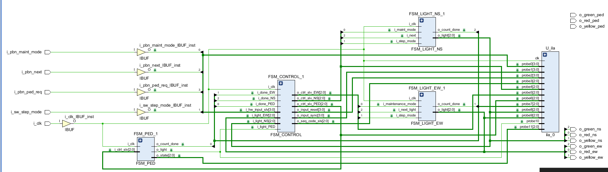

&nbsp;&nbsp;

# Entity: TOP
## Description
 Description: top level signal routing
## Interface

## Waveform

## RTL

## Generics and ports
### Table 1.1 Generics
### Table 1.2 Ports

| Port name        | Direction | Type      | Description                                              |
| ---------------- | --------- | --------- | -------------------------------------------------------- |
| i_clk            | in        | std_logic |  clock                                                   |
| i_pbn_ped_req    | in        | std_logic |  button for pedestrian priority request                  |
| i_pbn_maint_mode | in        | std_logic |  button for toggling between maintenance mode and normal |
| i_sw_step_mode   | in        | std_logic |  switch for activation of step mode                      |
| i_pbn_next       | in        | std_logic |  button to advance 1 step in step mode                   |
| o_red_ns         | out       | std_logic |  red lights                                              |
| o_red_ew         | out       | std_logic |  red lights                                              |
| o_green_ns       | out       | std_logic |  green lights                                            |
| o_green_ew       | out       | std_logic |  green lights                                            |
| o_yellow_ns      | out       | std_logic |  yellow lights                                           |
| o_yellow_ew      | out       | std_logic |  yellow lights                                           |
| o_light_ped      | out       | std_logic |  pedestrian light                                        |

## Signals, constants and types
### Signals

| Name            | Type                         | Description                        |
| --------------- | ---------------------------- | ---------------------------------- |
| ila             | trec_busila_ila_side         |  ila-side interface for ila        |
| busila_top_side | trec_busila_top_side         |  design-side interface for ila     |
| w_light_ns      | std_logic_vector(2 downto 0) |  car lights feedback               |
| w_light_ew      | std_logic_vector(2 downto 0) |  car lights feedback               |
| w_light_ped     | std_logic                    |  pedestrian light feedback         |
| w_done_NS       | std_logic                    |  done signals feedback             |
| w_done_EW       | std_logic                    |  done signals feedback             |
| w_done_ped      | std_logic                    |  done signals feedback             |
| w_hw_input_slv  | std_logic_vector(3 downto 0) |  hardware inputs interface         |
| w_hw_input      | trec_input                   |  hardware inputs interface         |
| w_ctrl_slv_NS   | std_logic_vector(2 downto 0) |  control busses towards light-fsms |
| w_ctrl_slv_ew   | std_logic_vector(2 downto 0) |  control busses towards light-fsms |
| w_ctrl_slv_ped  | std_logic_vector(2 downto 0) |  control busses towards light-fsms |
| w_ctrl_ns       | trec_fsm_ctrl                |  interface                         |
|  w_ctrl_ew      | trec_fsm_ctrl                |  interface                         |
|  w_ctrl_ped     | trec_fsm_ctrl                |  interface                         |
| w_seq_code_slv  | std_logic_vector(2 downto 0) |  sequence code interface           |
| w_in_reset_slv  | tslv_input                   |  testpoints for ila                |
| w_sync_in_slv   | tslv_input                   |  testpoints for ila                |
| w_ped_state     | std_logic_vector(2 downto 0) |                                    |

## Instantiations
- **U_ila**: ila_0

- **FSM_CONTROL_1**: work.FSM_CONTROL

- **FSM_LIGHT_NS_1**: work.FSM_LIGHT_NS(Behavioral)

- **FSM_LIGHT_EW_1**: work.FSM_LIGHT_EW

- **FSM_PED_1**: work.FSM_PED

## Elaboration:

# [RETOUR](../README.md)